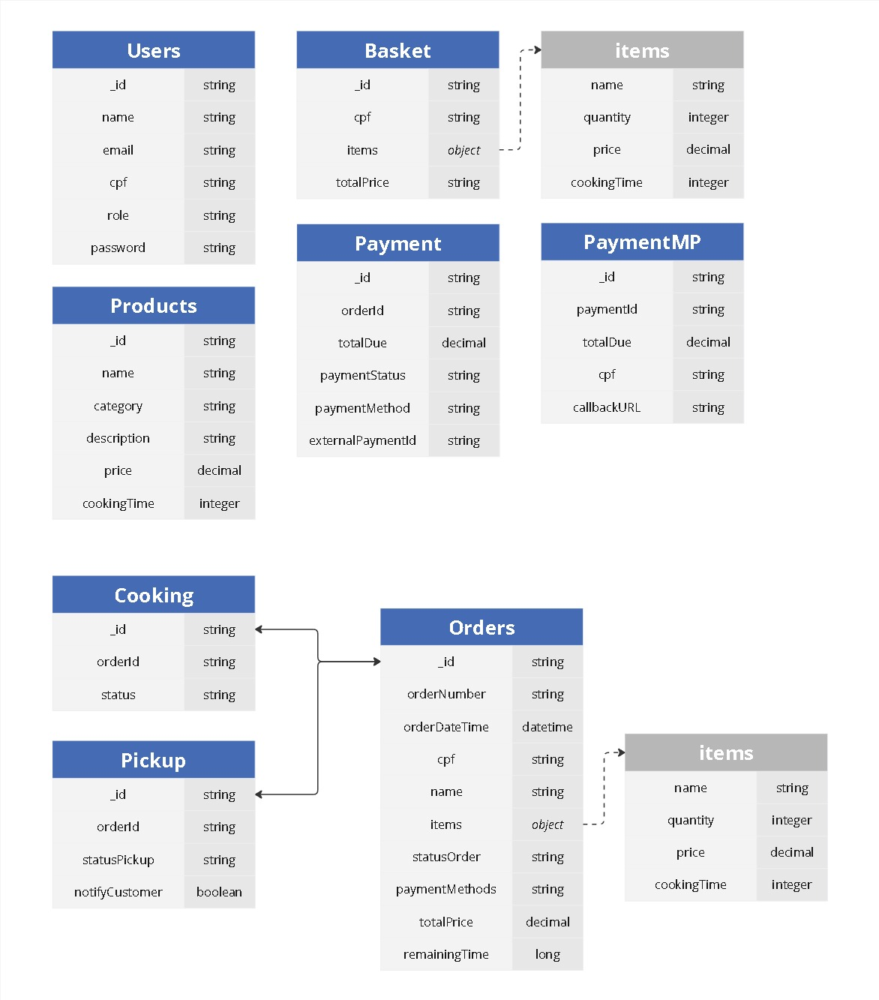

# Snackbar Database

## Overview
This project aims to provision the **Snackbar** application database system using **MongoDB Atlas** and **Terraform**.  

The infrastructure is managed by **Terraform**, ensuring that the database is correctly configured and accessible to the application. Additionally, the project contains scripts to restore the initial data for the **products** (menu items) and **orders** (customer orders) collections within the **Snackbar** database.  

## Project Structure
The project consists of the following files:

- **02-products-restore.js**: Script to restore the `products` collection in MongoDB.
- **03-orders-restore.js**: Script to restore the `orders` collection in MongoDB.
- **backend.tf**: Terraform backend configuration.
- **main.tf**: Defines the Terraform module for provisioning MongoDB Atlas.
- **outputs.tf**: Defines Terraform outputs, such as the database connection string.
- **variables.tf**: Defines sensitive and configurable Terraform variables.

## Technologies Used
- **MongoDB Atlas**: Cloud-based NoSQL database.
- **Terraform**: Infrastructure as code for database provisioning.
- **JavaScript**: Used for data restoration scripts.

## Configuration and Usage

### 1. Set Environment Variables
Before running the scripts and Terraform, configure the required variables in the `variables.tf` file, including MongoDB Atlas and AWS access credentials.

### 2. Provision the Infrastructure
Run the following commands to initialize the infrastructure:

```sh
terraform init
terraform apply
```

This will create the project in MongoDB Atlas and configure the necessary resources.

### 3. Restore the Data
After provisioning, restore the data by executing the scripts in MongoDB:

```sh
mongosh "<connection_string>" --username <username> --password <password> --eval "load('02-products-restore.js')"
mongosh "<connection_string>" --username <username> --password <password> --eval "load('03-orders-restore.js')"
```

### 4. Verify the Data
To check the inserted data, access MongoDB Atlas and query the `products` and `orders` collections.

## Data Structure

### `products` Collection

Contains the available products in the snackbar with the following fields:

- `name`: Product name
- `category`: Product category (Snack, Beverage, Side, etc.)
- `description`: Product description
- `price`: Product price
- `cookingTime`: Preparation time in minutes
- `image`: Product image URL

### `orders` Collection

Stores the orders placed, containing the following fields:

- `orderNumber`: Order number
- `orderDateTime`: Order date and time
- `cpf`: Customer CPF
- `name`: Customer name
- `items`: List of order items (product, quantity, price, etc.)
- `statusOrder`: Order status (e.g., "PAID")
- `paymentMethod`: Payment method
- `totalPrice`: Total price
- `remainingTime`: Remaining time for completion

# Database Choice and Justification



The **Snackbar** application requires a flexible, scalable, and high-performance database to efficiently manage its **menu items (products)** and **customer orders**. After evaluating different database options, we chose **MongoDB Atlas**, a cloud-based **NoSQL document database**, for the following reasons:  

## 1. **Flexible Schema for Dynamic Data**  
- The `products` and `orders` collections have varying data structures.  
- **MongoDB's document model** (BSON format) allows storing complex nested data, such as lists of items in an order, without requiring rigid schemas like relational databases.  
- This provides agility in evolving the application's data structure without costly migrations.  

## 2. **Scalability and Performance**  
- MongoDB Atlas provides **automatic scaling**, ensuring high availability even with increased demand.  
- **Sharding** enables distributing data across multiple servers, improving performance.  
- **Indexing** optimizes queries on frequently accessed fields like `orderNumber` and `cpf`.  

## 3. **Cloud-Native and Managed Service**  
- **MongoDB Atlas** offers automated backups, monitoring, and security features, reducing operational overhead.  
- **Multi-region deployment** enhances availability and disaster recovery.  

## 4. **Data Modeling Standards Applied**  
- **Normalization where necessary**: Reusable product data is stored in the `products` collection, avoiding redundancy.  
- **Denormalization for performance**: Orders store item details directly (`items` array), optimizing query speed and reducing joins.  
- **Indexing strategy**: Fields such as `orderNumber`, `cpf`, and `statusOrder` are indexed to improve query performance.  

## Conclusion  
MongoDB Atlas is the ideal choice for **Snackbar**, offering the flexibility, scalability, and cloud management necessary for efficient and reliable database operations.
